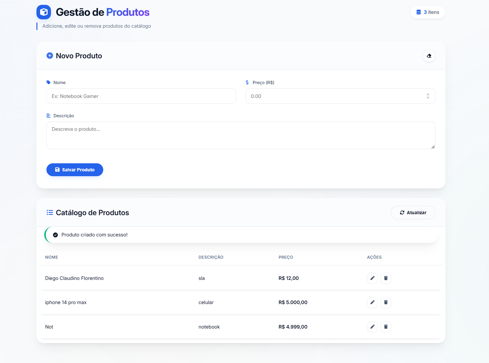

<pre>
 ██████╗ ██████╗ ██████╗ ██╗███╗   ██╗ ██████╗     ██████╗  ██████╗  ██████╗ ████████╗
██╔════╝ ██╔══██╗██╔══██╗██║████╗  ██║██╔════╝     ██╔══██╗██╔═══██╗██╔═══██╗╚══██╔══╝
╚█████╗  ██████╔╝██████╔╝██║██╔██╗ ██║██║  ███╗    ██████╔╝██║   ██║██║   ██║   ██║   
 ╚═══██╗ ██╔═══╝ ██╔══██╗██║██║╚██╗██║██║   ██║    ██╔══██╗██║   ██║██║   ██║   ██║   
██████╔╝ ██║     ██║  ██║██║██║ ╚████║╚██████╔╝    ██████╔╝╚██████╔╝╚██████╔╝   ██║   
╚═════╝  ╚═╝     ╚═╝  ╚═╝╚═╝╚═╝  ╚═══╝ ╚═════╝     ╚═════╝  ╚══════╝ ╚══════╝   ╚═╝   

 ░░░  C R U D - P R O D U T O S  ░░░
</pre>

 

  

 

> *"Depois de entender a pedra, é hora de construir a metrópole."*

---

  

---

## 🚀 O Manifesto

Se o Bare Metal representa **controle**, o Spring Boot representa **velocidade, produtividade e escalabilidade**.

Este projeto foca no que realmente importa: **regra de negócio e geração de valor**, eliminando complexidades desnecessárias de configuração.

A arquitetura foi construída utilizando:

- **Java + Spring Boot**
- **PostMan para testes** 
- **HTML, CSS e JavaScript** no frontend usando IA
- **Banco de dados MySQL** para desenvolvimento e testes  

O objetivo não é apenas fazer funcionar, mas criar uma base sólida, organizada e pronta para evoluir.

---

